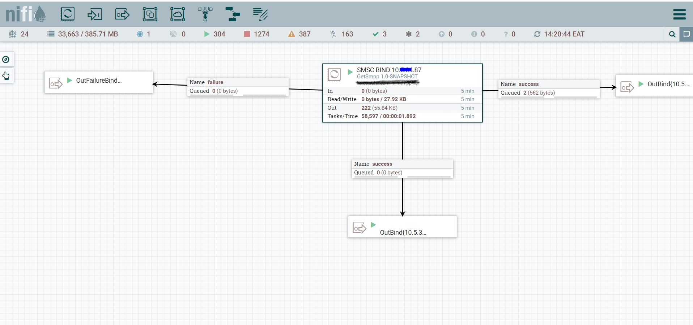
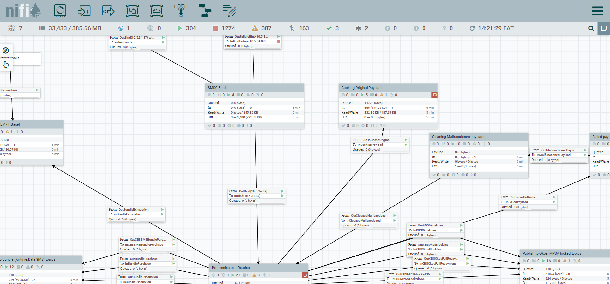
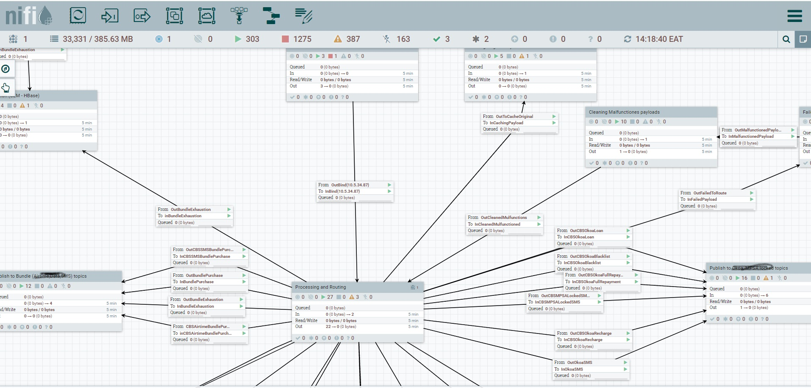

# Apache Nifi Custom SMPP Processor

##### Problem faced   
We were trying to read data from an internal system supporting only SMPP protocal unfortunately, Apache Nifi doesn't by   
default ship with any SMPP client processor.  

Tasks 
- Building processor that can connect via SMPP protocal 
- Package the data as JSON
- TPS of >=8000

##### Solution
We are thinking of having the processor having capabilities of 
- handling of executors
- handling of multiple threads (and cleanups)
- handling of rebind in case of lost connection
- handling of enquire_link to keep connection alive in periods of inactivity
- handling of queuing and windowing for async messaging.

##### How the solution integrated to the overall nifi pipeline

###### The Nifi custom Processor 

###### How the Nifi custom Processor fits in the pipeline - Binding layer

###### How the Nifi custom Processor fits in the pipeline - Overrall pipeline
 This includes 4 Layers  
  - Binding : This is where the custome processor runs and binds to the SMSC platform.
  - processing : This Filtering and routing of transactional payload to diffrent topics  based of keywords.
  - cashing  (Error Handling and audit): This layer is for HA incase Kafka is unavailable to acknowledge the transactions, 
            they will be routed to failed cache and succesfull  transactions (For audit purposes) on cassandra with TTL of 24hrs for successful cached payload
  - Persistance :  Write to  Kafka topics layer
  
  